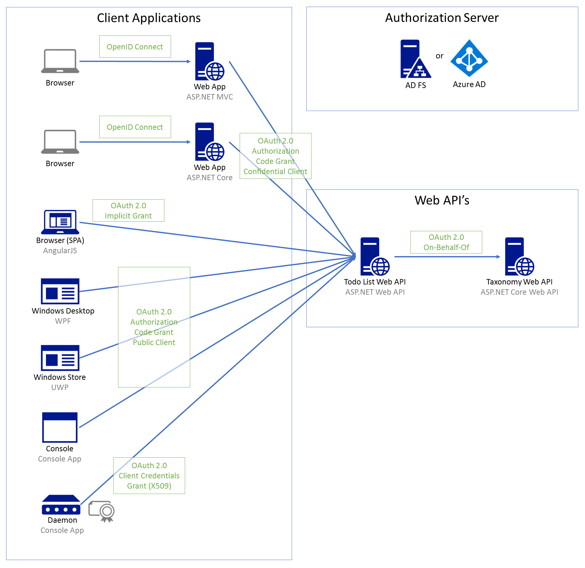

# Identity Samples

## Introduction

This repository contains a Visual Studio solution that demonstrates modern claims-based identity scenarios for .NET developers, with a particular focus on authentication and authorization using [Azure Active Directory](http://azure.microsoft.com/en-us/services/active-directory/) and/or [Windows Server Active Directory Federation Services](https://technet.microsoft.com/library/hh831502.aspx).

It is based on the [official Azure Active Directory samples repository](https://github.com/azure-samples?q=active-directory), but with the main difference that it contains a single solution to show multiple integrated scenarios instead of having multiple separate solutions for each scenario.

**IMPORTANT NOTE: The code in this repository is _not_ production-ready. It serves only to demonstrate the main points via minimal working code, and contains no exception handling or other special cases. Refer to the official documentation and samples for more information. Similarly, by design, it does not implement any caching or data persistence (e.g. to a database) to minimize the concepts and technologies being used.**

## Scenario

* There is a _Todo List_ service which stores simple todo items for users. A todo item has a _title_ and a _category_.
* Categories can be either _public_ (for all users) or _private_ (only for the user that created it) and are maintained in a separate _Taxonomy_ service (to show delegated on-behalf-of access from one service to another).
* The Todo List service can be accessed via a number of client applications.

## Setup

To use these samples, run the "Setup.ps1" PowerShell script in the "Setup" folder. This script allows you to:
* Create a client certificate (for the daemon service)
* Register all applications in Azure Active Directory and/or AD FS (storing the registered Client ID's and other configuration details in an XML file)
* Update the various configuration files in the solution with the values from the identity server (as stored in the XML file mentioned above)

## Implementation

| Project | Purpose | Protocol | Technology | Library/API |
|---------|---------|----------|------------|-------------|
| TaxonomyWebApi | Taxonomy service | OAuth 2.0 Bearer Tokens | ASP.NET Core Web API | [Microsoft.AspNetCore.Authentication.JwtBearer](https://github.com/aspnet/Security) |
| TodoListWebApi | Todo List service | OAuth 2.0 Bearer Tokens; OAuth 2.0 On-Behalf-Of | ASP.NET Web API | [Microsoft.Owin.Security.ActiveDirectory (Katana)](https://github.com/aspnet/AspNetKatana) |
| TodoListWebApp | Server-side web application | OpenID Connect; OAuth 2.0 Authorization Code Grant, Confidential Client | ASP.NET MVC | [Microsoft.Owin.Security.OpenIdConnect (Katana)](https://github.com/aspnet/AspNetKatana) |
| TodoListWebCore | Server-side web application | OpenID Connect; OAuth 2.0 Authorization Code Grant, Confidential Client | ASP.NET Core | [Microsoft.AspNetCore.Authentication.OpenIdConnect](https://github.com/aspnet/Security) |
| TodoListWebSpa | Client-side Single Page Application (SPA) | OAuth 2.0 Implicit Grant | AngularJS | [ADAL.js](https://github.com/AzureAD/azure-activedirectory-library-for-js) |
| TodoListWpf | Windows desktop application | OAuth 2.0 Authorization Code Grant, Public Client | WPF | [Microsoft.IdentityModel.Clients.ActiveDirectory (ADAL .NET)](https://github.com/AzureAD/azure-activedirectory-library-for-dotnet) |
| TodoListConsole | Windows desktop application | OAuth 2.0 Authorization Code Grant, Public Client | Console | [Microsoft.IdentityModel.Clients.ActiveDirectory (ADAL .NET)](https://github.com/AzureAD/azure-activedirectory-library-for-dotnet) |
| TodoListDaemon | Non-interactive daemon service | OAuth 2.0 Client Credential Grant, Confidential Client with Certificate authentication | Console | [Microsoft.IdentityModel.Clients.ActiveDirectory (ADAL .NET)](https://github.com/AzureAD/azure-activedirectory-library-for-dotnet) |
| TodoListUniversalWindows10 | Windows Store application | OAuth 2.0 Authorization Code Grant, Public Client | Windows 10 Universal App | [WebAuthenticationCoreManager](https://docs.microsoft.com/en-us/uwp/api/Windows.Security.Authentication.Web.Core.WebAuthenticationCoreManager) |

The implementation details of these scenarios are easily found in the code by searching for "[SCENARIO]". Other notable remarks can be found by searching for "[NOTE]".